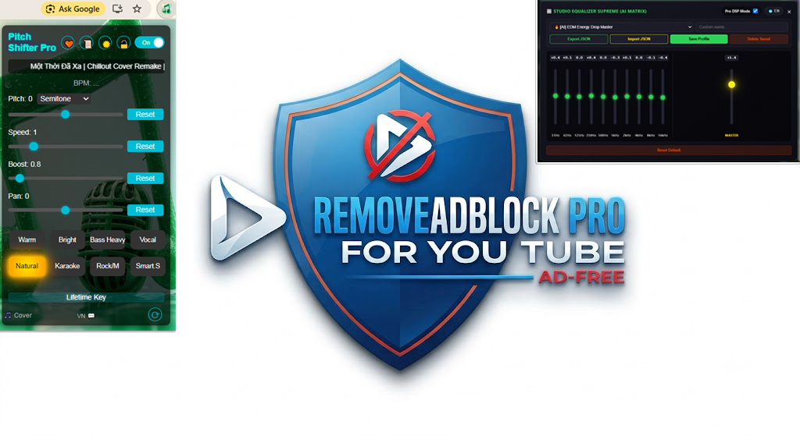

# 🎵 **PITCH SHIFTER PRO V2.607.2075 FINAL**
**Professional Voice Pitch Shifter & HiFi Audio Enhancer for YouTube**

> Advanced real-time audio processing extension that combines **Precision Pitch Shifting**, **Time-Stretching**, **HiFi AT2030 Audio Engine**, **Adaptive Dynamic EQ**, and **Intelligent Cover Recording**.  
> Delivers studio-grade sound for music listening, karaoke, and remix creation directly on YouTube.

**Author:** Thái Thông  
**Version:** 2.607.2074

---
### 🎥 **Demo on YouTube**

---
## ✨ **KEY FEATURES**

- **Precision Pitch Shifter** — ±12 semitones with Semitone & Smooth modes
- **Speed Control (Time Stretch)** — 0.25x to 4x while preserving pitch
- **HiFi Equalizer AI Matrix (AJU UI Bridge)** — 8-band Pro EQ + Real-time Dynamic EQ
- **Intelligent AI Sound Profiles** — 10+ presets including AI-driven adaptive modes
- **Studio-Quality Cover Recording** — Download high-quality `.webm` covers with your exact pitch, profile, and EQ settings
- **Nonstop Protection System** — Simulates natural user interaction to prevent video pausing
- **Favorites System** — Save, search, import/export your favorite settings
- **Beautiful UI** — Dark/Light themes, Vietnamese/English support, responsive design
- **Zero-Crash Architecture** — Memory-safe, anti-leak, optimized for long sessions

---
## 🧠 **ADVANCED TECHNOLOGY**

### **Jungle Audio Engine** (Core DSP)
- Real-time Web Audio API processing with **WebGPU** acceleration support
- Adaptive **FFT Size** management with performance-aware scaling
- **PureFade Master v16.0** — Smart fade buffer system with psychoacoustic modeling
- **Phase Linear Correction** — Quantum superposition bass engine + vocal entanglement
- **Room Correction Simulation** — Professional acoustic environment modeling
- **CPU Load Monitor v18.2** — Dynamic quality adjustment based on system load
- **Zero-GC Optimization** — Minimal memory allocation for sustained performance

### **AJU UI Bridge - Real-time Equalizer Controller**
- **Simple Mode** — 5-band intuitive controls (Bass, Mid, Vocal, Treble, Air)
- **Pro Mode** — 10-band parametric EQ (31Hz to 16kHz) + Master Gain
- **Dynamic Adaptive EQ** — Real-time frequency analysis with RMS energy detection
- **AI Matrix Presets**:
  - AI Perfect Balance
  - AI Karaoke Live (real-time vocal priority)
  - AI Vocal Follower
  - AI EDM Energy (drop-responsive)
  - AI Auto Genre
- **Lerp Smoothing** — Click/pop-free parameter transitions

### **Cover Recording System**
- Records video + processed audio with current pitch, EQ, and profile
- Multiple quality levels (Low → High + Audio-only MP3-style)
- Smart bitrate adaptation based on device performance
- Automatic filename generation including pitch & profile
- Memory-leak protected with full cleanup on completion

---
## 🎯 **PREMIUM SOUND MODES**

| Mode                  | Characteristics                          | Best For                     |
|-----------------------|------------------------------------------|------------------------------|
| **Warm**              | Deep warm bass, soft treble              | Ballad, Acoustic, Jazz       |
| **Bright**            | Crisp treble, detailed mids              | Pop, EDM, Dance              |
| **Bass Heavy**        | Powerful sub-bass, impactful low-end     | EDM, Hip-Hop, Trap           |
| **Vocal**             | Prominent, natural vocals                | Karaoke, R&B, Ballad         |
| **Pro Natural**       | Perfectly balanced spectrum              | All genres                   |
| **Karaoke Dynamic**   | Background suppression, vocal focus      | Live singing                 |
| **Rock/Metal**        | Aggressive mids & treble                 | Rock, Metal                  |
| **Smart Studio**      | AI-driven real-time optimization         | Any content                  |
| **AI Karaoke Live**   | Real-time dynamic adaptation             | Karaoke performance          |
| **AI EDM Energy**     | Drop-responsive energy boost             | Electronic music             |

---
## 📥 **INSTALLATION GUIDE**

1. Download the latest release or clone the repository
2. Extract the files
3. Open Chrome / Edge / Brave
4. Go to `chrome://extensions/` (or `edge://extensions/`)
5. Enable **Developer mode**
6. Click **"Load unpacked"** and select the extracted folder
7. Pin the extension for quick access

---
## 📋 **NOTES & TIPS**

- Best performance on **Chrome**, **Edge**, and **Brave**
- Cover recording works best with stable internet and sufficient RAM
- Some AI features may require user interaction to unlock Web Audio API
- Extension may need updating after major YouTube UI changes
- All processing happens locally — no audio data is sent to servers

---
## 🔧 **CONTACT & SUPPORT**

- **Author:** Thái Thông
- **Email:** [ThaiThongsj@gmail.com](mailto:ThaiThongsj@gmail.com)

### 💰 **Support Development**

**Vietcombank Account**  
`9898661918` — **NGUYỄN NGỌC THÁI THÔNG**

---
**Thank you for using Pitch Shifter Pro!**  
May your music always sound perfect ✨

**Made with ❤️ for a better viewing experience**
